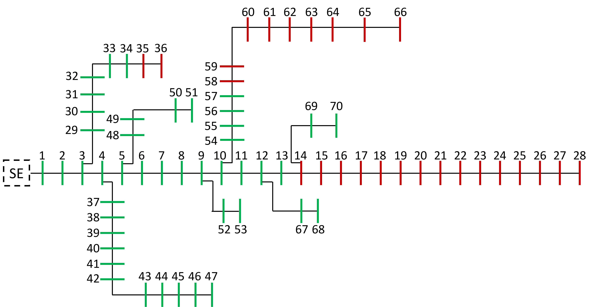

<div align="center">
    
    
    Dados do Modelo
</div>

Dados Referentes ao **Artigo** submetido ao **Simpósio Brasileiro de Sistemas Elétricos** (SBSE) 2023

<br><br>

# 🔎 Legenda

## Arquivo: _Dados_Barra.csv_

Cada linha do arquivo representa as informações de cada uma das 70 barras.

Em cada linha são presentes as seguintes colunas, em ordem:

- **ID**: Identificador da barra;
- **Tipo**: 1 (PQ) ou 3 (Referência)
- **Carga_P**: Carga Ativa Nominal [pu];
- **Carga_Q**: Carga Reativa Nominal [pu];
- **V**: Módulo de Tensão da Barra [pu];
- **Theta**: Ângulo de Fase da Barra [rad];
- **Vmax**: Máxima Tensão Permitida [pu];
- **Vmin**: Mínima Tensão Permitida [pu];

## Arquivo: _Dados_Ramo.csv_

Cada linha do arquivo representa as informações de cada uma das 69 linhas.

Em cada linha são presentes as seguintes colunas, em ordem:

- **ID**: Identificador do ramo;
- **De**: Barra de origem do ramo;
- **Para**: Barra de destino do ramo;
- **R**: Resistência do Ramo;
- **X**: Reaatância do Ramo;

## Arquivo: _Dados_Curva_de_Carga_P.csv_

Cada linha do arquivo representa as informações de curva de carga de potência ativa para cada uma das 70 barras.

Em cada linha são presentes as seguintes colunas, em ordem:

- **Barra**: Barra na qual a curva de carga está associada;
- **P_Hora_X**: Potência ativa para a hora X, dada por uma porcentagem da carga nominal do barramento;

## Arquivo: _Dados_Curva_de_Carga_Q.csv_

Cada linha do arquivo representa as informações de curva de carga de potência reativa para cada uma das 70 barras.

Em cada linha são presentes as seguintes colunas, em ordem:

- **Barra**: Barra na qual a curva de carga está associada;
- **Q_Hora_X**: Potência reativa para a hora X, dada por uma porcentagem da carga nominal do barramento;

<br><br>

# ✉️ Contato

Dúvidas ou sugestões? Entre em contato com a gente
- **E-mail:** cristhiangro@gmail.com

<br><br>

# 💬 Cite este repositório

```bibtex
@article{STQE-SBSE-2023,
    title    = {Repositório de Dados: Uma Avaliação em Série-Temporal Quase-Estática da Capacidade de Hospedagem de Geração FV em Redes de Distribuição},
    year     = {2023},
    url      = {https://github.com/CristhianGRO/dados-artigo-sbse-2023},
    author   = {Cristhian Gabriel da Rosa de Oliveira; Gabriel Rodrigues Tremeschin},
    keywords = {Capacidade de Hospedagem; Recursos Energéticos Distribuídos; Redes de Distribuição; Sistemas Fotovoltaicos.},
}
```
