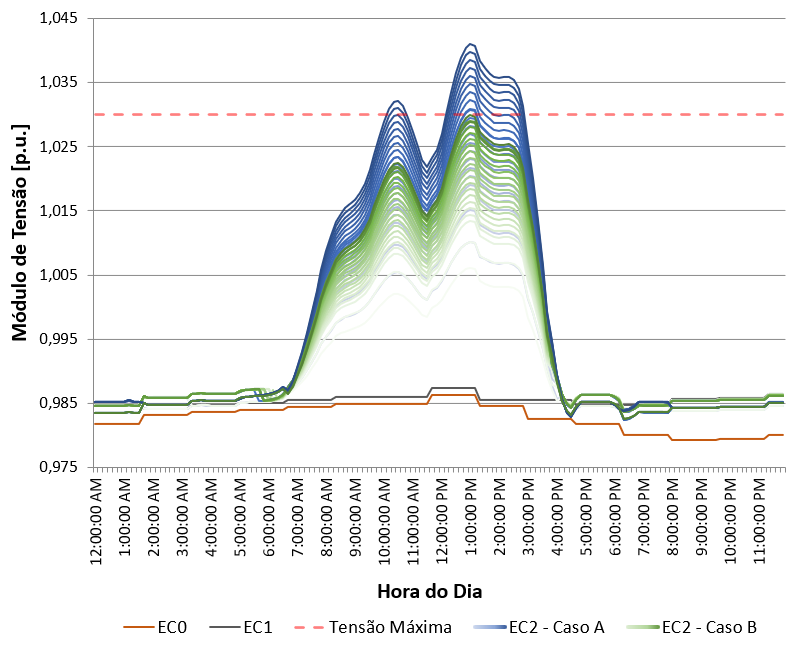

<div align="center">
    
    
    Resultados
</div>

Dados Referentes ao **Artigo** submetido ao **Simpósio Brasileiro de Sistemas Elétricos** (SBSE) 2023

<br><br>

# 🔎 Legenda

Cada um dos arquivos contém os módulos de tensão e ângulo de fase para cada uma das 70 barras, além das perdas ativas e reativas para cada um dos 69 ramos, em cada um dos 144 intervalos de tempo analisados (intervalos espaçados em 10 minutos). 

As colunas para cada intervalo possuem os seguintes dados: 

- **V_X**: Tensão da barra X [pu];
- **Theta_X**: Ângulo de Fase da barra X [pu];
- **Perdas_P_X**: Perda Ativa no Ramo X [pu];
- **Perdas_Q_X**: Perda Reativa no Ramo X[pu];

<br><br>

# ✉️ Contato

Dúvidas ou sugestões? Entre em contato com a gente
- **E-mail:** cristhiangro@gmail.com

<br><br>

# 💬 Cite este repositório

```bibtex
@article{STQE-SBSE-2023,
    title    = {Repositório de Dados: Uma Avaliação em Série-Temporal Quase-Estática da Capacidade de Hospedagem de Geração FV em Redes de Distribuição},
    year     = {2023},
    url      = {https://github.com/CristhianGRO/dados-artigo-sbse-2023},
    author   = {Cristhian Gabriel da Rosa de Oliveira; Gabriel Rodrigues Tremeschin},
    keywords = {Capacidade de Hospedagem; Recursos Energéticos Distribuídos; Redes de Distribuição; Sistemas Fotovoltaicos.},
}
```
